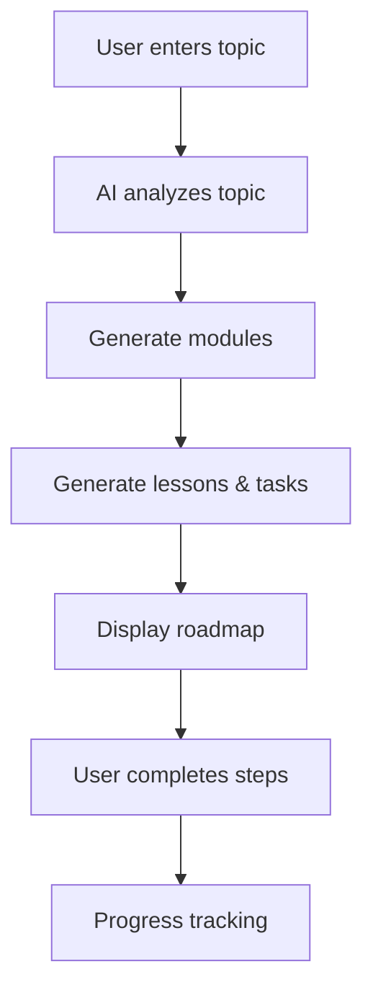

# LearnX

## Table of Contents

- [Problem](#problem)
- [Solution](#solution)
- [Quick Start (Windows PowerShell)](#quick-start-windows-powershell)
- [Tech Stack](#tech-stack)
- [Core Pages](#core-pages)
- [Project Structure](#project-structure)
- [How It Works](#how-it-works)
- [Feature Status](#feature-status)
- [Contribution Opportunities](#contribution-opportunities)
- [Contributing](#contributing)
- [License](#license)

LearnX is a community-driven platform where anyone can learn anything in simple, structured steps. Users pick a topic (any category) or create their own, and AI automatically generates a complete learning track with modules, lessons, and small actionable tasks.

<p align="left">
  
  
  
  
  
</p>

---

## Problem

Learning on the internet is scattered.
YouTube video series, blogs, courses, docs — everything is everywhere. Most people struggle because they don’t get a clear step-by-step path to follow. They waste time deciding *what to learn next*.

## Solution

LearnX converts any topic into a structured learning journey.
Just type the topic → AI generates lessons → users follow each step and track progress. This removes confusion and makes learning simpler, cleaner, and faster.

---

## Quick Start (Windows PowerShell)

```powershell
npm install
npm run dev
````

Now open → [http://localhost:3000](http://localhost:3000)

---

## Tech Stack

* Next.js (App Router)
* Tailwind CSS
* TypeScript
* Framer Motion

---

## Core Pages

| Page                   | Link                                                                                 |
| ---------------------- | ------------------------------------------------------------------------------------ |
| **Home**               | `/`                                                                                  |
| **Roadmap**            | `/roadmap`                                                                           |
| **GitHub Repo**        | **[https://github.com/tilakjain619/LearnX](https://github.com/tilakjain619/LearnX)** |
| **Contributing Guide** | `CONTRIBUTING.md`                                                                    |
| **License**            | `LICENSE`                                                                            |

---

## Project Structure

```
app/              → routes + pages
public/           → static assets
next.config.ts    → next config
tsconfig.json     → ts config
package.json      → dependencies
```

---

## How It Works

LearnX transforms any topic into a clear, step-by-step learning path using AI.

**1. Enter a topic**  
Users can choose a topic (e.g., “DSA”, “React”, “Java”, “Machine Learning”, “Cloud Computing”) or create their own.

**2. AI generates a structured roadmap**  
The system breaks the topic into:
- Modules  
- Lessons  
- Small actionable tasks  

**3. Follow the steps**  
Users complete tasks one by one.

**4. Track progress**  
Each module shows completion status so learners always know what to do next.

---

## Feature Status

| Feature                              | Status        | Notes |
|--------------------------------------|--------------|-------|
| AI topic → auto lessons (v1)         | 🚧 In Progress | Type a topic and generate structured modules & lessons (v1) |
| Category discovery                   | 🔜 Planned     | Curated categories (Tech, Finance, etc.) |
| Learning progress tracking           | 🔜 Planned     | Mark lessons done, resume where left off, completion % |
| Quizzes & mini-assignments           | 🔜 Planned     | Auto-generated checks and instant feedback |
| Public paths & sharing               | 🔜 Planned     | Publish and share learning paths |
| Streaks & leaderboard                | 🔜 Planned     | Daily streaks and friendly leaderboard |

---

## Contribution Opportunities

Want to help improve LearnX? Here are great places to start:

- ✔️ Add new features from the Feature Table  
- ✔️ Improve UI/UX on the Roadmap page  
- ✔️ Work on progress tracking logic  
- ✔️ Write documentation (README, guides, examples)  
- ✔️ Fix bugs listed in Issues  

Start by checking open issues:  
👉 **https://github.com/tilakjain619/LearnX/issues**

---

## Learning Flow Diagram (Simple)




---

## Contributing

PRs and ideas are welcome!
Please check → [`CONTRIBUTING.md`](./CONTRIBUTING.md) before submitting.

---

## License

MIT — see [`LICENSE`](./LICENSE) for details.